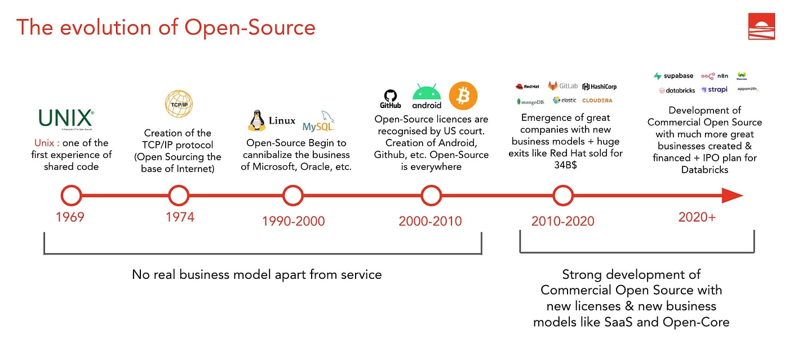

# Comparison of Open Source vs. Proprietary Software
  
### Submitted by: Anjali Kushwaha  

## Table of Contents  
 [**1. Introduction to Open Source**](#1-introduction-to-open-source)  
 [**2. Benefits of Open Source**](#2-benefits-of-open-source)  
 [**3. Open Source vs. Proprietary Software**](#3-open-source-vs-proprietary-software)  
 [**4. Popular Open Source Software**](#4-popular-open-source-software)    
 [**5. Open Source Licensing**](#5-open-source-licensing)  
 [**6. How to Contribute to Open Source**](#6-how-to-contribute-to-open-source)  
 [**7. Open Source in Different Industries**](#7-open-source-in-different-industries)    [**8. Challenges and Future of Open Source**](#8-challenges-and-future-of-open-source)  
 [**9. Conclusion**](#conclusion)  
 [**10. References**](#references)  

---

## 1. Introduction to Open Source  

The term **open source** refers to software whose source code is publicly available. Open-source software is released under a license that allows users to use, modify, and distribute the code. Developers can collaborate to add new features, improve existing functionalities, and fix bugs. This makes open-source software highly flexible and community-driven.  

### Examples of Open-Source Software:  
- **Operating Systems:** Android, Ubuntu, Linux  
- **Internet Browsers:** Mozilla Firefox, Chromium  
- **Integrated Development Environments (IDEs):** Visual Studio Code (VS Code), Android Studio, PyCharm, Xcode  

  

---

## 2. Benefits of Open Source  

1. **Flexibility and Agility**  
   Open-source software offers multiple ways to solve problems, ensuring technology agility and avoiding vendor lock-in.  

2. **Speed**  
   Businesses can quickly adopt and test open-source solutions without waiting for proprietary vendors to introduce new features.  

3. **Cost-Effectiveness**  
   Open-source software is generally free or low-cost, making it a budget-friendly alternative to proprietary software.  

4. **Ability to Start Small**  
   Organizations can begin with free community versions and later upgrade to enterprise-supported solutions if needed.  

5. **Strong Security**  
   The open-source community continuously reviews and improves security, reducing vulnerabilities compared to proprietary software.  

6. **Attracts Better Talent**  
   Open-source projects encourage collaboration and innovation, attracting skilled developers who want to contribute to industry advancements.  

7. **Shared Maintenance Costs**  
   The development and maintenance of open-source software are distributed among contributors, reducing costs for individual organizations.  

---

## 3. Open Source vs. Proprietary Software  

| S.No. | Open-Source Software | Proprietary Software |  
|:---:|-------------------|--------------------|  
| **1** | Source code is publicly available for modification. | Source code is private and restricted. |  
| **2** | Developed through open collaboration. | Developed and maintained by a company or individual. |  
| **3** | Can be installed and modified freely. | Requires a valid license for installation and use. |  
| **4** | More flexible, encourages innovation. | Limited flexibility due to licensing restrictions. |  
| **5** | Usually free of charge. | Requires payment for a license. |  
| **6** | Community-driven bug fixes and security patches. | Vendor is responsible for all updates and fixes. |  
| **7** | Limited intellectual property protection. | Full intellectual property protection. |  
| **8** | Typically maintained by non-profit organizations. | Maintained by for-profit companies. |  
| **9** | Examples: Linux, Firefox, VLC Media Player, OpenOffice. | Examples: Windows, macOS, Microsoft Office, Adobe Photoshop. |  

---

## 4. Popular Open Source Software  

1. **Internxt** – Open-source cloud storage.  
2. **Linux** – Open-source operating system.  
3. **KeePass** – Secure password manager.  
4. **Thunderbird** – Email management tool.  
5. **FileZilla** – User-friendly FTP client.  
6. **Audacity** – Audio editing software for music and podcasts.  
7. **Shotcut** – Video editing software.  
8. **GIMP** – Image and photo editing tool.  
9. **VLC Media Player** – Plays almost any media format.  

---

## 5. Open Source Licensing 

Open-source licenses define the legal terms for using, modifying, and distributing software.  

### Common Open Source Licenses: 
- **MIT License** – Allows free use, modification, and distribution with minimal restrictions.  
- **Apache License** – Permits modifications but requires credit to the original author.  
- **GNU General Public License (GPL)** – Requires that any derivative work also be open source.  
- **BSD Licenses** – Similar to MIT but with fewer restrictions.  
- **GNU Lesser General Public License (LGPL)** – Permits linking to proprietary software.  
- **Mozilla Public License (MPL)** – Requires modifications to be open-source but allows integration with proprietary software.  

---

## 6. How to Contribute to Open Source  

### Ways to Contribute:  
1. **Find Open-Source Projects** – Websites like GitHub, GitLab, and Open Source Guides list projects you can contribute to.  
2. **Learn Version Control (Git, GitHub)** – Track changes and collaborate with developers.  
3. **Submit Pull Requests** – Suggest changes to the project and get them reviewed.  
4. **Follow Best Practices** – Write clean code, test thoroughly, and communicate respectfully with other contributors.  

---

## 7. Open Source in Different Industries 

### Industries Using Open Source Software:  
- **Technology** – Used in cloud computing, AI, and software development.  
- **Education** – Universities use open-source platforms like Moodle for learning management.  
- **Finance** – Banking systems use open-source frameworks for security and efficiency.  
- **Healthcare** – Open-source tools support medical research and hospital management.  
- **Government** – Many governments adopt open-source solutions for transparency and security.  

---

## 8. Challenges and Future of Open Source 

### Challenges:  
1. **Security Vulnerabilities** – Open code can be exploited if not monitored properly.  
2. **Steep Learning Curve** – Some open-source tools require technical expertise.  
3. **Lack of Professional Support** – Free versions may not offer dedicated support like proprietary software.  

### Future Trends:  
- **Growth in AI and Machine Learning** – Open-source AI tools like TensorFlow and PyTorch will continue to expand.  
- **Cloud Computing** – Kubernetes and Docker are becoming industry standards.  
- **Increased Enterprise Adoption** – More companies are shifting towards open-source solutions for cost savings and flexibility.  

---

## Conclusion  

Open-source software is no longer just a niche movement—it is the foundation of modern technology. As we move into 2025, open-source trends will shape AI, cloud computing, and cybersecurity. The increasing adoption of OSS in enterprises, government, and emerging technologies will reinforce its importance in the digital world.  

---

## References 

**1- [https://surl.li/kgumtv](https://surl.li/kgumtv)**

**2- [https://www.geeksforgeeks.org/introduction-to-open-source-and-its-benefits/](https://www.geeksforgeeks.org/introduction-to-open-source-and-its-benefits/)**

**3- [https://surl.li/uvkizn](https://surl.li/uvkizn)**

**4- [https://www.techradar.com/best/best-open-source-software](https://www.techradar.com/best/best-open-source-software)**

**5- [https://en.wikipedia.org/wiki/Open-source\_license](https://en.wikipedia.org/wiki/Open-source_license)**

**6- [https://opensource.guide/how-to-contribute/](https://opensource.guide/how-to-contribute/)**

**7-[https://surl.li/ccsoty](https://surl.li/ccsoty)**

**8- [https://www.inmotionhosting.com/blog/open-source-software-trends/](https://www.inmotionhosting.com/blog/open-source-software-trends/)**

**8.1- [https://thinksys.com/development/benefits-and-challenges-open-source-software/](https://thinksys.com/development/benefits-and-challenges-open-source-software/)**
