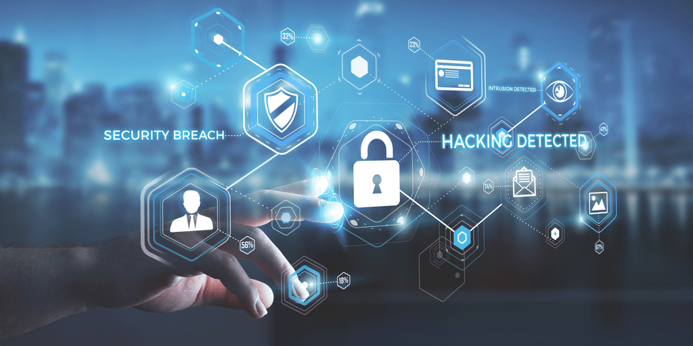
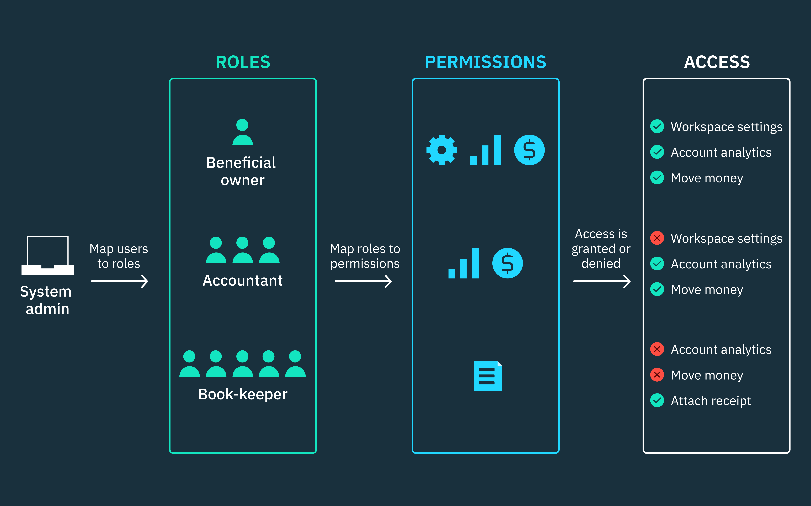
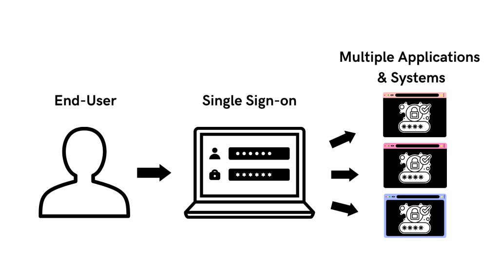
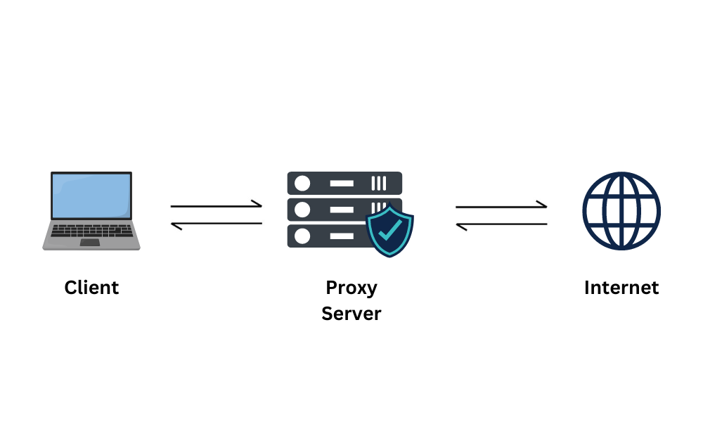

# Essential Area of Modern IT Systems

**Presented by:** Anjali Kushwaha

## Table of Contents
1. [Introduction to Security](#introduction-to-security)
2. [Identity, Confidentiality, Integrity](#identity-confidentiality-integrity)
3. [Role-Based Access Control (RBAC)](#role-based-access-control-rbac)
4. [Single Sign-On (SSO)](#single-sign-on-sso)
5. [Proxies & Firewalls](#proxies-firewalls)
6. [Real-world Examples of Security Breaches or Defenses](#real-world-examples-of-security-breaches-or-defenses)

## Introduction to Security

Security is the protection from risks or dangers, which result from the balance of threats, vulnerabilities, countermeasures, and value. A key tool in designing security is the CIA triad: confidentiality, integrity, and availability. The security framework can be divided into four areas: attack prevention, detection, isolation, and recovery. Threats can be internal or external, malicious or environmental, and some are uncontrollable. An often overlooked threat is social engineering, which can be addressed through proactive security awareness programs.

### The CIA Triad
The CIA Triad consists of three fundamental principles in information security:

#### Confidentiality:
- **Definition:** Ensures data is kept private and accessible only to authorized users.
- **Example:** Imagine an online banking system where only the account holder can access their financial details. Encryption is used to protect sensitive information like passwords and account numbers.
- **Tools:** Encryption, multi-factor authentication, and access controls.
- **Risk:** If hackers gain access to the system (e.g., through weak passwords), they could steal personal information.

#### Integrity:
- **Definition:** Ensures data is accurate, consistent, and hasn’t been altered without authorization.
- **Example:** In an e-commerce platform, integrity ensures that the price and product description displayed to a customer haven’t been tampered with. A digital signature can verify the authenticity of the data.
- **Tools:** Hashing, digital signatures, and version control systems.
- **Risk:** If a malicious actor manipulates the price on an e-commerce website, customers could be charged incorrectly.

#### Availability:
- **Definition:** Ensures that systems and data are accessible when needed, without disruptions.
- **Example:** A hospital’s patient database must be available at all times for doctors to access medical records. If a server goes down, the data must be recovered quickly to avoid delays in patient care.
- **Tools:** Backups, disaster recovery systems, and redundant servers.
- **Risk:** A DDoS attack could overwhelm the hospital's website, making it unavailable during a critical time. Or, a hardware failure might cause temporary inaccessibility to important systems.

---

## Role-Based Access Control (RBAC)

RBAC is a model that assigns access permissions based on predefined roles within an organization. It restricts system access to users based on their role, ensuring that users can only access resources necessary for their duties.

### Example:
- **Security Analyst:** Can configure firewalls but can't access customer data.
- **Sales Rep:** Can view customer accounts but cannot manage firewall settings.

### How RBAC Works:

1. **Role Assignment:** Users are assigned one or more roles that grant them specific permissions.
   - Example: A "Nurse" role in a hospital allows access to medical records but not the ability to prescribe medications.
2. **Role Authorization:** Only authorized users can assume roles.
   - Example: Only HR staff can be assigned the “HR” role to access employee records.
3. **Permission Authorization:** Permissions are granted based on the role assigned, ensuring users can only perform specific actions.
   - Example: A junior developer may access source code but cannot deploy changes without a supervisor's approval.

### Models of RBAC:
- **Core RBAC:** Basic model where users are assigned roles that grant permissions.
- **Hierarchical RBAC:** Roles inherit permissions based on the organizational hierarchy (e.g., Executives have more permissions than managers).
- **Constrained RBAC:** Enforces separation of duties (e.g., different roles for requesters and approvers).
- **Symmetric RBAC:** Provides deeper visibility and flexibility, often used in large organizations.

### Advantages:
- Simplified access management, improved security, compliance facilitation, scalability, and reduced risk of human error.

### Disadvantages:
- Role explosion, rigidity, potential for over-privileged roles, implementation complexity, and inflexibility in dynamic environments.

RBAC is highly effective for managing access and maintaining security in many organizations but requires careful planning to ensure roles are properly defined and adjusted as necessary.

---

## Single Sign-On (SSO)

SSO is a protocol that allows users to authenticate once and gain access to multiple applications without needing to log in again for each. It simplifies the user experience by reducing password fatigue and enhances security by consolidating authentication.

### How SSO Works:
1. A user logs in to an application.

2. The application redirects the user to an Identity Provider (IdP) for authentication.
3. The IdP validates the user and sends an encrypted SSO token.
4. The user gains access to the application without re-entering credentials.
5. For other apps in the trusted network, the same token grants access.

### Example:
- Logging into Asana using either your Asana username or Google account. After authenticating with Google, you can access Asana and other linked apps without re-entering credentials.

### SSO Token:
A digital credential (e.g., Bearer token, SAML assertion, or Kerberos ticket) used across multiple applications to confirm a user’s identity. It is stored securely (in session or cookies) and transmitted when accessing other apps.

### Benefits of SSO:
- **Reduced Password Fatigue:** Users only need to remember one set of credentials.
- **Faster Logins:** Quick access to apps without re-entering passwords.
- **Lower IT Costs:** Fewer password reset requests to help desks.
- **Improved Security:** Centralized control and stronger measures like Multi-Factor Authentication (MFA).
- **Enhanced Productivity:** Users can access multiple applications seamlessly.
- **Less Third-party Risk:** Secure external authentication via OAuth, reducing risks tied to third-party sites.

### Types of SSO Protocols:
- **SAML:** Common for web apps, used for exchanging authentication data.
- **OAuth:** Allows users to access data across apps without re-entering credentials, often used in mobile apps.
- **OIDC:** An extension of OAuth 2.0, supports SSO by providing user information.
- **Kerberos:** A secure authentication protocol used mainly in Windows environments.
- **Physical Token Authentication:** Uses physical tokens (e.g., smart cards) for added security.

### SSO Security:
While SSO enhances security by reducing password risks and simplifying user management, it can be vulnerable to attacks if not properly configured. It's crucial to implement SSO with secure configurations and combine it with additional security measures like Multi-Factor Authentication (MFA).

### Disadvantages:
- **Single Point of Failure:** If the IdP fails, access to all apps is blocked.
- **Complex Setup:** Difficult to integrate across multiple systems.
- **Security Risks:** Weak IdP security can lead to widespread access.
- **Over-Privilege:** Users may gain too much access if not properly managed.

---

## Proxies & Firewalls

### What is a Proxy Server?
A proxy server is a server that acts as an intermediary between your device and the internet. It helps to hide your real IP address, improving privacy and security when browsing online.

### How Does a Proxy Server Work?

1. **Request:** When you want to access a website, your device sends a request to the proxy server, not directly to the website.
2. **Forwarding:** The proxy server then forwards your request to the website, using its own IP address.
3. **Response:** The website sends the response (such as a web page) back to the proxy server.
4. **Return:** The proxy server sends the response back to you. The website only sees the proxy server’s IP address, not yours.

### Types of Proxy Servers:
- **Forward Proxy:** Hides your real IP address when you access websites.
- **Reverse Proxy:** Protects the identity of web servers from clients (used by websites to shield their server).
- **Transparent Proxy:** Doesn't hide your IP but can cache content to speed up access.
- **Anonymous Proxy:** Hides your IP address, though it may still be detectable.
- **High Anonymity Proxy:** Fully hides your IP and prevents detection of proxy use.
- **Web Proxy:** Routes web traffic through a proxy server.
- **Rotating Proxy:** Changes the IP address frequently for increased anonymity.

### Advantages:
- **Privacy Protection:** Keeps your real IP address hidden while browsing.
- **Security:** Encrypts data to protect it from hackers and prying eyes.
- **Bypass Restrictions:** Helps you access websites or content that are blocked in certain regions.
- **Faster Browsing:** Caches frequently visited websites to load them faster.
- **Content Filtering:** Blocks unwanted websites or content, useful for businesses and parents.

### Disadvantages:
- **Security Risks with Free Proxies:** Some free proxies may not have proper encryption and could steal your data, such as credit card information.
- **Tracking:** Some proxies keep logs of your browsing activity, which may be exposed or misused.
- **No Encryption:** Without encryption, your internet traffic can be intercepted by hackers.
- **Performance Issues:** A poorly configured proxy can slow down your browsing speed.

---

## What is a Firewall?

A firewall is a security device (either hardware or software) that controls incoming and outgoing network traffic based on security rules. Think of it as a digital gatekeeper that protects your network from harmful traffic while allowing safe communication.

### How Does a Firewall Work?

1. **Traffic Filtering:** A firewall checks each incoming and outgoing data packet against its rule set.
2. **Action Taken:** Based on the rules, the firewall either allows, rejects, or drops the packet.

### Types of Firewalls:
- **Packet Filtering Firewall:** Inspects data packets based on IP address, protocol, and ports.
- **Stateful Inspection Firewall:** Keeps track of ongoing connections.
- **Application Layer Firewall:** Filters traffic up to the application level.
- **Next-Generation Firewalls (NGFW):** Can inspect deep packet data, filter applications, and more.

### Advantages:
- **Protection from Unauthorized Access:** Blocks hackers from accessing your network.
- **Malware Prevention:** Helps in blocking traffic from known malicious sources.
- **Control of Network Access:** You can decide who gets access to specific resources.
- **Regulation Compliance:** Firewalls help meet legal requirements in certain industries.

### Disadvantages:
- **Complexity:** Setting up and managing firewalls can be time-consuming.
- **Limited Visibility:** Firewalls mainly filter traffic and may miss security threats at the application level.
- **False Sense of Security:** Relying only on firewalls can give a false sense of complete protection.
- **Performance Impact:** Firewalls can slow down network traffic due to the extra processing they require.
- **Cost:** For large businesses, firewalls can become expensive.

---

## Real-world Examples of Security Breaches or Defenses
- **YouTube (2020):** 4 million user accounts were compromised due to weak security measures.
- **Yum! Brands (2023):** A ransomware attack led to the theft of personal information, including driver’s license numbers.
- **Zappos (2012):** 24 million user accounts were hacked, exposing sensitive data.
- **Zynga (2019):** 173 million user accounts were compromised in a breach.
- **Experian (2020):** 23 million records were stolen using social engineering tactics.

### Data Breaches:
Data breaches are particularly common in sectors like government, retail, and technology. In 2019, a massive leak exposed 2.7 billion identity records. By 2020, the global cost of data breaches was predicted to reach $2.1 trillion. One of the biggest breaches, known as the "mother of all breaches," revealed over 26 billion records, including data from high-profile companies like Twitter, Adobe, and LinkedIn.

Data breaches can occur at any time, and the financial and security risks are enormous. It’s crucial to protect systems and sensitive information to reduce these risks.

---

## References:
1. [ResearchGate: Introduction to Security](https://www.researchgate.net/publication/301193839_Introduction_to_Security)
2. [Fortinet: CIA Triad](https://www.fortinet.com/resources/cyberglossary/cia-triad)
3. [IBM: RBAC](https://www.ibm.com/think/topics/rbac)
4. [Frontegg: Single Sign-On (SSO)](https://frontegg.com/guides/single-sign-on-sso)
5. [GeeksforGeeks: Proxy Server](https://www.geeksforgeeks.org/what-is-proxy-server/)
6. [GeeksforGeeks: Firewall](https://www.geeksforgeeks.org/introduction-of-firewall-in-computer-network/)
7. [Wikipedia: List of Data Breaches](https://en.wikipedia.org/wiki/List_of_data_breaches)

 

 
